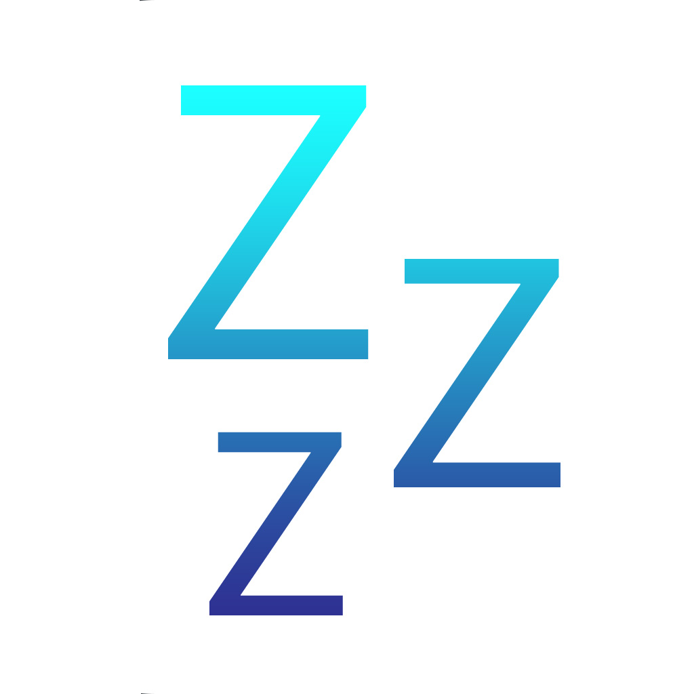
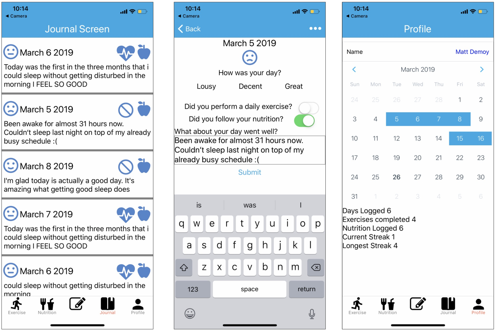

<!-- PROJECT LOGO -->
 

  

  <h3 align="center">BetterSleep</h3>

  

    The Pocket Sleep Journal
     
    <a href="https://github.com/github_username/repo">
  

<!-- TABLE OF CONTENTS -->
## Table of Contents

* [About the Project](#about-the-project)
  * [Built With](#built-with)
* [Roadmap](#roadmap)
* [Contact](#contact)

<!-- ABOUT THE PROJECT -->
## About The Project

  

With the goal of improving peoples sleep bettersleep allows users to get information on building better sleep habits 
and the tools to build them.

### Built With

*  React Native
*  Google Firefase
*  Redux

<!-- ROADMAP -->
## Roadmap

See the [open issues](https://github.com/github_username/repo/issues) for a list of proposed features (and known issues).

<!-- CONTACT -->
## Contact

Matthew Demoy - Matthew_Demoy@student.uml.edu

Project Link: https://github.com/Matthew-Demoy/BetterSleep-Ejected

<!-- MARKDOWN LINKS & IMAGES -->
<!-- https://www.markdownguide.org/basic-syntax/#reference-style-links -->
[contributors-shield]: https://img.shields.io/github/contributors/othneildrew/Best-README-Template.svg?style=flat-square
[contributors-url]: https://github.com/othneildrew/Best-README-Template/graphs/contributors
[forks-shield]: https://img.shields.io/github/forks/othneildrew/Best-README-Template.svg?style=flat-square
[forks-url]: https://github.com/othneildrew/Best-README-Template/network/members
[stars-shield]: https://img.shields.io/github/stars/othneildrew/Best-README-Template.svg?style=flat-square
[stars-url]: https://github.com/othneildrew/Best-README-Template/stargazers
[issues-shield]: https://img.shields.io/github/issues/othneildrew/Best-README-Template.svg?style=flat-square
[issues-url]: https://github.com/othneildrew/Best-README-Template/issues
[license-shield]: https://img.shields.io/github/license/othneildrew/Best-README-Template.svg?style=flat-square
[license-url]: https://github.com/othneildrew/Best-README-Template/blob/master/LICENSE.txt
[linkedin-shield]: https://img.shields.io/badge/-LinkedIn-black.svg?style=flat-square&logo=linkedin&colorB=555
[linkedin-url]: https://linkedin.com/in/othneildrew
[product-screenshot]: assets/screens/JournalScreen.png
